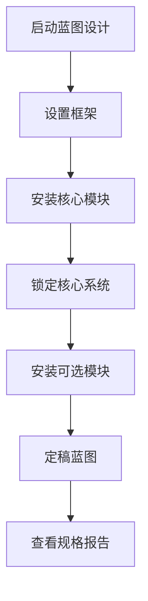

# 太空船蓝图设计 eDSL 使用文档


## 一、程序运行方式

### 1. 运行环境要求


* 编程语言：Python 3.6 及以上版本（无需安装任何第三方库，依赖 Python 标准库即可）

* 运行设备：支持 Python 环境的电脑（Windows/macOS/Linux 均可）

### 2. 启动与运行步骤


1. **代码保存**：将 eDSL 完整代码复制到文本编辑器（如记事本、VS Code），保存为`.py`格式文件（建议命名为`spaceship_blueprint.py`）；

2. **启动程序**：

* 方式 1（终端运行）：打开电脑终端（Windows 为 “命令提示符”，macOS/Linux 为 “终端”），切换到代码文件所在文件夹，输入命令`python ``spaceship_blueprint.py`，按回车即可运行；

* 方式 2（IDE 运行）：用 VS Code、PyCharm 等 Python IDE 打开保存的`.py`文件，点击 “运行” 按钮（通常为三角形图标），即可执行程序；

1. **运行结果**：程序默认包含 4 个测试用例（1 个合法设计 + 3 个违规场景），运行后会在终端 / IDE 控制台输出设计结果（合法设计将显示 ASCII 格式的蓝图规格报告，违规场景会提示具体错误原因）。

## 二、DSL 使用方法

### 1. 核心设计流程（操作顺序）

eDSL 遵循 “从基础到核心，再到可选” 的太空船设计逻辑，必须按以下顺序操作，否则会触发安全规则校验并提示错误：




### 2. 关键操作说明（含参数设置）


| 操作名称                    | 功能描述                               | 参数要求                                    | 领域说明                            |
| ----------------------- | ---------------------------------- | --------------------------------------- | ------------------------------- |
| `start_blueprint()`     | 启动新的蓝图设计（设计起点）                     | 无参数                                     | 每次设计新太空船，必须先执行该操作               |
| `.set_frame()`          | 设置太空船基础框架（固定属性：质量 1000kg，总插槽 10 个） | 无参数                                     | 框架是所有模块的安装基础，必须在启动后立即执行         |
| `.add_reactor(类型)`      | 安装反应堆（核心模块，可安装多个）                  | 类型参数：仅支持 “Fusion”（聚变）、“Antimatter”（反物质） | 反应堆提供动力，至少安装 1 个才能锁定核心系统        |
| `.add_engine(类型)`       | 安装引擎（核心模块，仅可安装 1 个）                | 类型参数：仅支持 “Ion”（离子）、“Plasma”（等离子）        | 引擎提供推力，决定太空船推进能力                |
| `.add_life_support(类型)` | 安装生命支持系统（核心模块，仅可安装 1 个）            | 类型参数：仅支持 “Standard”（标准）、“Advanced”（高级）  | 保障船员生存，必须安装 1 个                 |
| `.add_bridge(类型)`       | 安装舰桥（核心模块，仅可安装 1 个）                | 类型参数：仅支持 “Explorer”（探索型）、“Command”（指挥型） | 控制中枢，必须安装 1 个                   |
| `.lock_core_systems()`  | 锁定核心系统（进入可选模块安装阶段）                 | 无参数                                     | 锁定前需确认所有核心模块已安装，锁定后不可修改核心模块     |
| `.add_shield(类型)`       | 安装护盾（可选模块，仅可安装 1 个）                | 类型参数：仅支持 “Magnetic”（磁盾）、“Phase”（相位盾）    | 需注意反应堆类型依赖（聚变反应堆禁相位盾，反物质反应堆禁磁盾） |
| `.add_sensors(类型)`      | 安装传感器（可选模块，仅可安装 1 个）               | 类型参数：仅支持 “Basic”（基础）、“Advanced”（高级）     | 增强太空船探测能力，非必须安装                 |
| `.finalize_blueprint()` | 定稿蓝图（不可再修改设计）                      | 无参数                                     | 定稿后才能生成规格报告，定稿后不可添加 / 删除任何模块    |
| `.print_spec()`         | 输出蓝图规格报告（可视化）                      | 无参数                                     | 仅能对 “已定稿蓝图” 执行该操作               |

### 3. 安全规则提示（避免设计错误）


* 核心模块（反应堆、引擎等）仅能在 “锁定核心系统” 前安装，可选模块（护盾、传感器）仅能在锁定后安装；

* 所有模块安装后，总插槽消耗不能超过 10 个（框架固定总插槽）；

* 定稿后的蓝图不可修改，若需调整设计，需重新启动蓝图（执行`start_blueprint()`）；

* 安装护盾时，需匹配反应堆类型（聚变→磁盾，反物质→相位盾），混合反应堆类型不可安装任何护盾。

## 三、print\_spec 与 finalize\_blueprint 配合方式

### 1. 核心逻辑关系

`finalize_blueprint()`是 “生成可输出对象” 的关键操作，`print_spec()`是 “展示对象规格” 的可视化操作，二者必须按 “先定稿、后输出” 的顺序配合，流程如下：


1. **生成定稿对象**：完成所有模块安装后，执行`.finalize_blueprint()`，该操作会将当前设计固化为 “不可修改的定稿蓝图对象”，并返回该对象（需用变量接收，如`finalized_ship = 设计流程.finalize_blueprint()`）；

2. **输出规格报告**：对接收的定稿对象调用`.print_spec()`，即可在控制台输出 ASCII 格式的规格报告（如`finalized_ship.print_spec()`）。

### 2. 错误配合场景提示


* 若未执行`finalize_blueprint()`，直接调用`print_spec()`：会触发安全规则校验，提示 “仅已定稿的蓝图可输出规格”；

* 若执行`finalize_blueprint()`后未接收对象，直接调用`print_spec()`：会报 “无此方法” 错误（如`设计流程.finalize_blueprint().print_spec()`是合法的，但`设计流程.print_spec()`不合法）。

## 四、使用示例

### 1. 完整合法设计代码

以下代码实现一艘 “探索型太空船” 的设计，包含 1 个聚变反应堆、1 个离子引擎、1 个高级生命支持系统、1 个探索型舰桥、1 个磁盾、1 个基础传感器，所有设计符合安全规则：


```
\# 1. 导入eDSL代码（若将示例代码写在同一文件中，无需额外导入）

\# 2. 启动设计并执行完整流程

if \_\_name\_\_ == "\_\_main\_\_":

&#x20;   # 用变量接收定稿蓝图对象

&#x20;   finalized\_ship = (start\_blueprint()

&#x20;                     # 1. 设置框架

&#x20;                     .set\_frame()

&#x20;                     # 2. 安装核心模块

&#x20;                     .add\_reactor("Fusion")  # 安装聚变反应堆

&#x20;                     .add\_engine("Ion")      # 安装离子引擎

&#x20;                     .add\_life\_support("Advanced")  # 安装高级生命支持

&#x20;                     .add\_bridge("Explorer")  # 安装探索型舰桥

&#x20;                     # 3. 锁定核心系统

&#x20;                     .lock\_core\_systems()

&#x20;                     # 4. 安装可选模块

&#x20;                     .add\_shield("Magnetic")  # 安装磁盾（匹配聚变反应堆）

&#x20;                     .add\_sensors("Basic")    # 安装基础传感器

&#x20;                     # 5. 定稿蓝图

&#x20;                     .finalize\_blueprint())

&#x20;  &#x20;

&#x20;   # 6. 输出规格报告

&#x20;   finalized\_ship.print\_spec()
```

### 2. 对应的 print\_spec 输出结果

运行上述代码后，控制台会输出以下 ASCII 格式的规格报告，包含所有关键技术指标：


```
+================================================+

\|           SPACESHIP BLUEPRINT SPECIFICATION   |

+================================================+

\| Total Slots                     |            10 |

\| Slots Used                      |             9 |

\|------------------------------------------------|

\| Total Mass                      |        1570 kg |

\|------------------------------------------------|

\| Total Power Output              |          1000 W |

\| Total Power Consumption         |           575 W |

\| Power Balance                   |           425 W |

\|------------------------------------------------|

\| Thrust-to-Weight Ratio          |       0.3185 |

+================================================+
```

### 3. 关键指标说明（领域视角）


* 总插槽：10 个（框架固定），已用 9 个（剩余 1 个插槽，可后续扩展小型模块）；

* 总质量：1570kg（含框架 1000kg + 所有模块 570kg，符合探索型太空船轻量化需求）；

* 功率平衡：425W（输出 1000W - 消耗 575W，动力充足，可支持额外设备）；

* 推重比：0.3185 N/kg（离子引擎推力 500N，总质量 1570kg，满足中短途探索航行需求）。

> （注：文档部分内容可能由 AI 生成）